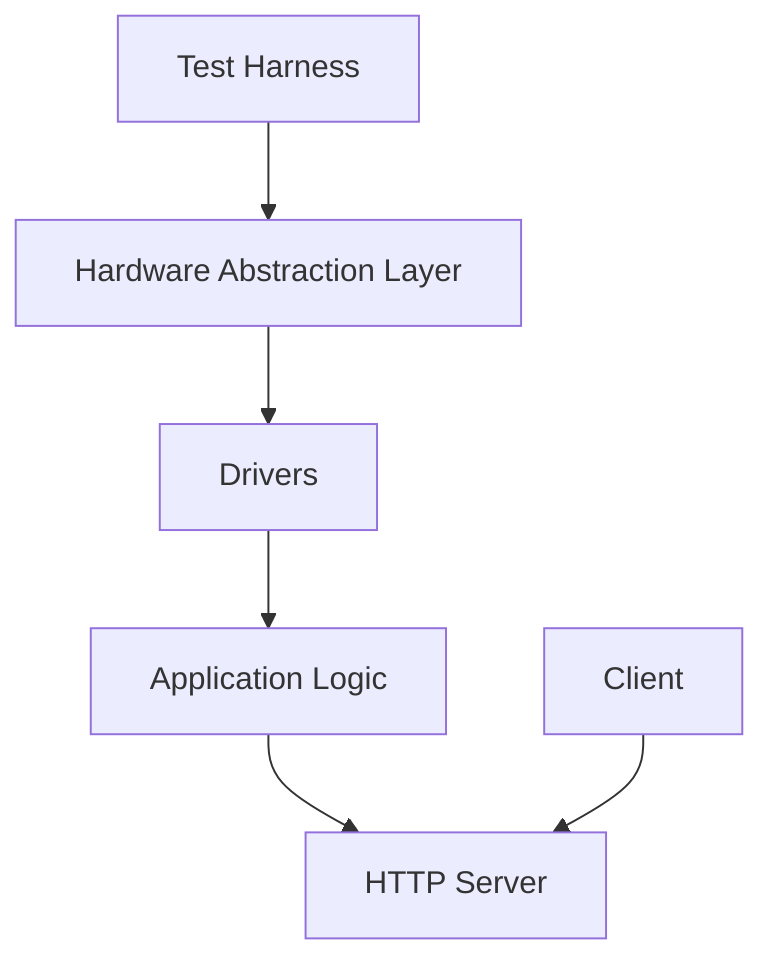
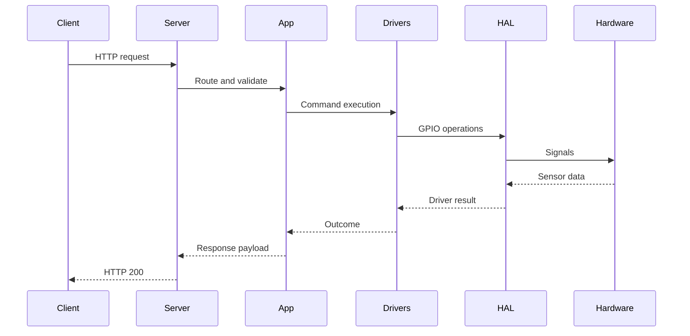

# Architecture Overview

This document outlines how the Register MVP components interact: the hardware abstraction layer (HAL), device drivers, application logic, HTTP server, and deterministic test harness.

## Component Relationships

- **HAL** wraps low level GPIO access and provides a consistent interface for real hardware and simulations.
- **Drivers** implement devices such as the shutter, hopper, and scale on top of the HAL.
- **Application logic** coordinates drivers to perform transactions and other high level tasks.
- **Server** exposes the application logic over an HTTP API.
- **Test harness** exercises the application through the HAL with deterministic inputs to validate behavior.

## Transaction Processing

The sequence above shows a typical transaction. Client requests are handled by the server, routed through application logic to the drivers and HAL, and results propagate back to the client.
